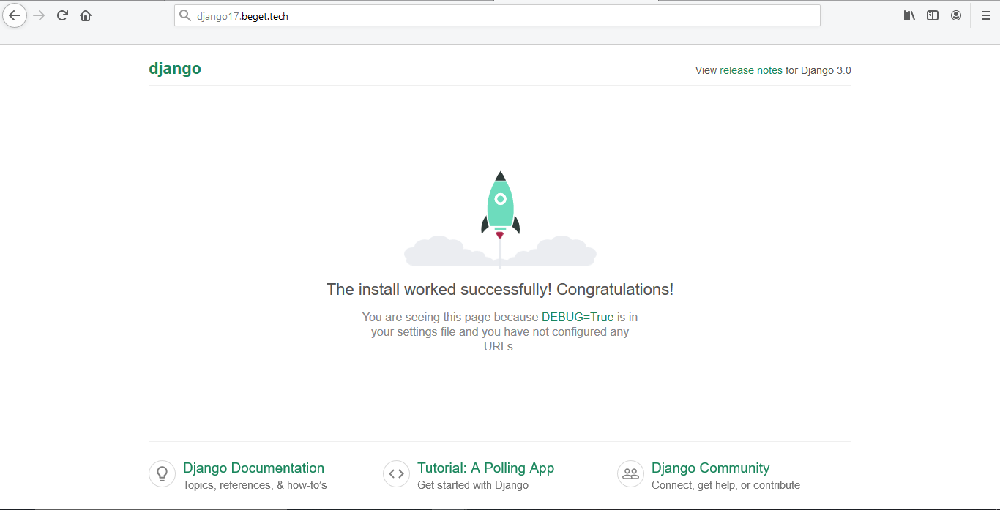

# Инструкция по созданию сайта и установки "Django" на хостинге "Beget"


## 1. Начальная настройка:

1. В разделе сайты создаём новый сайт, после создаём новое доменное имя привязываем его к созданному сайту
2. Дальше на `Beget` включаем доступ по `ssh` и подключаемся к нашему серверу через терминал с помощью `ssh`. Логин и пароль от хоста те, которые нам отправляли по смс и на почту
3. Подключитесь по SSH к серверу:

```shell
local@host:~$ ssh user@ip_adress
```

4. Затем подключитесь к Docker-контейнеру:

```shell
django17@quasar:~ [0] $ ssh localhost -p222
```

5. Теперь перейдите во временный каталог на аккаунте:

```shell
(docker) django17@quasar:~ [0] $ cd ~/.beget/tmp/
```

> __Обратите внимание!__
>
> _Если каталог не создан, ответ будет следующим:_
> ```shell
> -bash: cd: /home/i/idkfa/.beget/tmp: No such file or directory
> ```
> _Создать временный каталог и перейти в него можно следующей командой:_
> ```shell
> mkdir -p ~/.beget/tmp && cd ~/.beget/tmp/
> ```


## 2. Установка более свежей версии openssl

> __Обратите внимание!__
>
> _Если вам необходим `Python` версии 3.10 и выше, то необходимо выполнить действия в этом разделе._
> <br>
> _Если вам необходим `Python` версии ниже чем 3.10, то пропустите этот раздел и переходите к следующему._

1. Скачайте архив openssl версии 1.1.1:

```shell
(docker) django17@quasar:~/.beget/tmp [0] $ wget https://www.openssl.org/source/openssl-1.1.1l.tar.gz
```

2. Распакуйте архив и перейдите в папку с файлами:

```shell
(docker) django17@quasar:~/.beget/tmp [0] $ tar -xvzf openssl-1.1.1l.tar.gz && cd openssl-1.1.1l
```

3. С помощью утилиты configure настройте необходимые зависимости, префиксы и переменные, после чего будет сгенерирован
   Makefile:

```shell
(docker) django17@quasar:~/.beget/tmp/openssl-1.1.1l [0] $ ./config --prefix=$HOME/.local --openssldir=$HOME/.local/ssl '-Wl,--enable-new-dtags,-rpath,$(LIBRPATH)'
```

4. Запустите процесс компиляции и установки:

```shell
(docker) django17@quasar:~/.beget/tmp/openssl-1.1.1l [0] $ make -j$((`nproc`/4)) && make install
```

5. Проверить что openssl установлен корректно можно командой:

```shell
(docker) django17@quasar:~/.beget/tmp/openssl-1.1.1l [0] $ ~/.local/bin/openssl version
```

6. Если в ответ вы получили следующий вывод (или подобный), то openssl установлен корректно:

```shell
OpenSSL 1.1.1l 24 Aug 2021
```


## 3. Сборка Python

> __Обратите внимание!__
>
> _В качестве примера установки используется версия `Python 3.11.0`._
> <br>
> _Если вы устанавливаете другую версию, то цифры в названиях папок и архивов будут отличаться._

1. Перейдите во временный каталог:

```shell
(docker) django17@quasar:~ [0] $ cd ~/.beget/tmp
```

2. Скачайте архив необходимой версии Python:

```shell
(docker) django17@quasar:~/.beget/tmp [0] $ wget https://www.python.org/ftp/python/3.11.0/Python-3.11.0.tgz
```

3. Распакуйте архив и сразу перейдите в каталог с исходным кодом:

```shell
(docker) django17@quasar:~/.beget/tmp [0] $ tar -xvzf Python-3.11.0.tgz && cd Python-3.11.0
```

4. С помощью утилиты configure настройте необходимые зависимости, префиксы, переменные, после чего будет сгенерирован Makefile.

> __Обратите внимание!__
>
> _Для Python меньше 3.10 команда будет отличаться._

* Для Python 3.10 и выше:

```shell
(docker) django17@quasar:~/.beget/tmp/Python-3.11.0 [0] $ ./configure --prefix=$HOME/.local --with-openssl=$HOME/.local --with-openssl-rpath=auto --enable-optimizations --enable-loadable-sqlite-extensions LDFLAGS="-Wl,-rpath /usr/local/lib"
```

* Для Python 3.9.x и ниже:

```shell
(docker) django17@quasar:~/.beget/tmp/Python-3.9.0 [0] $ ./configure --prefix=$HOME/.local --enable-optimizations --enable-loadable-sqlite-extensions LDFLAGS="-Wl,-rpath /usr/local/lib"
```

5. Теперь запустите процесс компиляции и установки:

```shell
(docker) django17@quasar:~/.beget/tmp/Python-3.11.0 [0] $ make -j$((`nproc`/4)) && make install
```

6. Проверить корректность установки можно следующей командой:

```shell
(docker) django17@quasar:~ [0] $ python3 -V 

# Output: Python 3.11.0
```

7. Помимо Python, также устанавливается пакетный менеджер pip:

```shell
(docker) django17@quasar:~ [0] $ pip3 -V

# Output: pip 22.3 from /home/d/django17/.local/lib/python3.11/site-packages/pip (python 3.11)
```

> __ПОМЕТКА!__
>
> _ПРИ ИСПОЛЬЗОВАНИИ КОМАНД ВАМ НУЖНО ПИСАТЬ ПЕРВЫЕ ДВЕ ЦИФРЫ В ВЕРСИИ ПИТОНА ИЛИ PIP._
> <br>
> _ВОТ ПРИМЕРЫ: python3.11 -V или pip3.11 -V_

## 4. Настройка окружения virtualenv


> ___!!!___
>
> Если сайтов, использующих `Python`, на аккаунте несколько, то для каждого может потребоваться
> <br>
> свое окружение и свой набор пакетов разных версий, которые могут конфликтовать между собой.
> <br>
> Эту проблему можно решить настройкой виртуального окружения с помощью `virtualenv`

1. Для начала перейдите в каталог с сервером (вместо «u» и «user» укажите первую букву логина и сам логин):

```shell
cd ~/home/u/user/директория_сайта/public_html
```

2. Если у вас собранный локально Python, для установки virtualenv укажите полный путь до pip:

```shell
(docker) django17@quasar:~/ директория_сайта [0] $ ~/.local/bin/pip3.11 install virtualenv
```

3. Дальше следует создать директорию окружения.

> __Обратите внимание!__
>
> _Лучше присвоить название директории с отсылкой к проекту, для которого она будет использоваться._
> <br>
> _Это нужно для того, чтобы в дальнейшем не путаться._
> <br>
> _Команды будут отличаться в зависимости от версии Python._

* Чтобы создать директорию окружения с названием venv, используя Python 2.7, выполните команду:

```shell
(docker) django17@quasar:~/ директория_сайта [0] $ python -m virtualenv venv
```

* Для создания директории окружения с названием venv, используя Python 3.6, выполните команду:

```shell
(docker) django17@quasar:~/ директория_сайта [0] $ python -m virtualenv venv --python=/usr/bin/python3.6
```

4. Для локально собранного Python команда выглядит так:

```shell
(docker) django17@quasar:~/ директория_сайта [0] $ ~/.local/bin/python3.11 -m virtualenv venv
```

5. Для входа в окружение выполните следующую команду:

```shell
(docker) django17@quasar:~/ директория_сайта [0] $ source venv/bin/activate
```

6. Проверяем, что вход выполнен успешно:

```shell
(docker) django17@quasar:~/ директория_сайта [0] $ which python3.11

# Output: /home/d/django17/django17.beget.tech/venv/bin/python
```

7. Чтобы выйти из окружения, выполните команду:

```shell
(docker) django17@quasar:~/ директория_сайта [0] $ deactivate
```

> __ПОМЕТКА!__
>
> _ПОКА ЧТО ЛУЧШЕ НЕ ВЫХОДИТЬ ИЗ ВИРТУАЛЬНОГО ОКРУЖЕНИЯ._
> <br>
> _ОНО НАМ ЕЩЁ ПРИГОДИТСЯ!_

## 5. Установка и настройка Django

1. Установка Django

```shell
docker) django17@quasar:~/ директория_сайта [0] $ pip3.11 install django
```

2. Затем необходимо создать новый проект

```shell
(docker) django17@quasar:~/ директория_сайта [0] $ django-admin.py startproject НАЗВАНИЕ_ПРОЕКТА
```

3. Далее переходим в директорию проекта Django -> в директорию с настройками Django

```shell
cd ~/директория_сайта/public_html/НАЗВАНИЕ_ПРОЕКТА/НАЗВАНИЕ_ПРОЕКТА
```

4. Создаём файл passenger_wsgi.py со следующим содержимым:

```python
import os, sys
from django.core.wsgi import get_wsgi_application


site_user_root_dir = '<полный_путь_до_каталога_с_проектом>'
sys.path.insert(0, os.path.join(site_user_root_dir, 'НАЗВАНИЕ ПРОЕКТА'))
sys.path.insert(1,os.path.join(site_user_root_dir,'<полный_путь_до_Django>'))

os.environ.setdefault('DJANGO_SETTINGS_MODULE', 'НАЗВАНИЕ ПРОЕКТА.settings')
application = get_wsgi_application()
```

5. Посмотреть версию и путь до Django можно так:

````shell
(docker) django17@quasar:~/django17.beget.tech [0] $ python3.6 -c "import django; print(django.get_version()); print(django.__file__)"

# Output: 3.0.5 ; /home/o/django17/.local/lib/python3.6/site-packages/django/__init__.py
````

6. Редактирование списка ALLOWED_HOSTS

> ___!!!___
>
> Для последних версий `Django` также требуется явно задать домен, на котором работает сайт.
> <br>
> Для этого нужно отредактировать список `ALLOWED_HOSTS` в файле `<название_проекта>/<название_проекта>/settings.py`.
> <br>
> Вместо указания определенного домена можно использовать символ подстановки `*`, тогда проект будет работать на любом домене.

В нашем примере он будет выглядеть так:

```python
ALLOWED_HOSTS = ['django17.beget.tech']
```

7. Для корректной отдачи статического контента средствами Nginx необходимо создать символьную ссылку public, указывающую на public_html:

```shell
(docker) django17@quasar:~/ директория_сайта [0] $ ln -s public_html public
```

8. Затем нужно создать файл htaccess в public_html и указать в нем путь до Python:

```shell
PassengerEnabled On
PassengerPython /home/u/user/директория_сайта/public_html/venv/bin/python3.11
PassengerAppRoot /home/u/user/директория_сайта/public_html/НАЗВАНИЕ_ПРОЕКТА_/НАЗВАНИЕ_ПРОЕКТА/
```

> __Обратите внимание!__
>
> _Путь может отличаться в зависимости от используемой версии Python._

9. После завершения настройки окружения необходимо создать каталог tmp, где будет храниться файл restart.txt:

```shell
(docker) django17@quasar:~/ директория_сайта [0] $ mkdir tmp; touch tmp/restart.txt
```

10. Обновление изменённых файлов на сервере

> ___!!!___
>
> После каждого изменения файлов сервера нужно будет _“нажимать”_ на пустой файл `restart.txt` для того, чтобы изменения вступили в силу. 
> <br>
> Это нужно делать в директории где вы создали этот файл, главное его надо создать в той же директории где находиться сам сайт. 
<br>

Команда для рестарта:

```shell
touch tmp/restart.txt
```

> ___!!!___
>
> В целях безопасности на сервере установлена система разграничения прав доступа между сайтами, основанная на `POSIX ACL`.
> <br>
> Сделано это для того, чтобы файлы одного сайта не могли обращаться к файлам других сайтов. Приложения, которые будут
> <br>
> устанавливаться в каталоги `.local`, по умолчанию недоступны при попытке их запуска через сайт. Необходимо настроить
> <br>
> общий доступ к этим каталогам через `Файловый менеджер` (подробная справка по разделу).

11. Для проверки работоспособности нужно открыть сайт в браузере:



## 6. Загрузка и запуск сайта

> ___!!!___
>
> После того как вы проверили, что `Django` запустился можно приступать к загрузке самого сайта.
> <br>
> Для этого вам необходимо зайти на `beget` в файловый менеджер и загрузить туда ваш локальный сайт на `Django`.

1. Копирование папок на хостинг

> ___!!!___
>
> Копируем на хостинг папки с вашими приложениями из вашего локального проекта, так же копируем файл `urls.py` для навигации в главную директорию проекта.

2. Изменения файла settings.py

* В файл `settings.py` из вашего локального проекта добавляем в конец файла добавляем настройку корня статических файлов:

```python
STATIC_ROOT = '/home/u/user/директория_сайта/public_html/staticl'
```

* В строке `ALLOWED_HOSTS` пишем адрес сервера:

```python
ALLOWED_HOSTS = ['адрес_сервера']
```

3. Для начала перейдите в каталог с сервером (вместо “u” и “user” укажите первую букву логина и сам логин):

* Переходим:

```shell
cd ~/директория_сайта /public_html/
```

* Создаем папку

```shell
mkdir static
```

4. После переходим в только что созданную папку `staticl` и выполняем команду:

```shell
python3.11 ./home/u/user/директория_сайта/public_html/НАЗВАНИЕ_ПРОЕКТА/manage.py collectstatic
```

5. Переходим в `~/директория_сайта/public_html/НАЗВАНИЕ_ПРОЕКТА` и выполняем миграцию проекта:

```shell
python3.11 manage.py migrate
```

# Проверяем, что наш сайт Django на хостинге работает так же, как и локальный сайт!

<hr><br>
