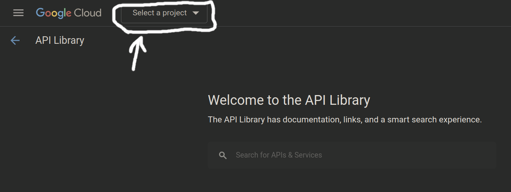
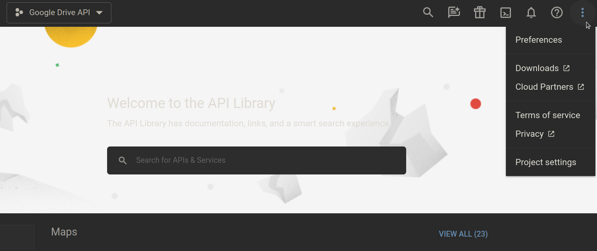
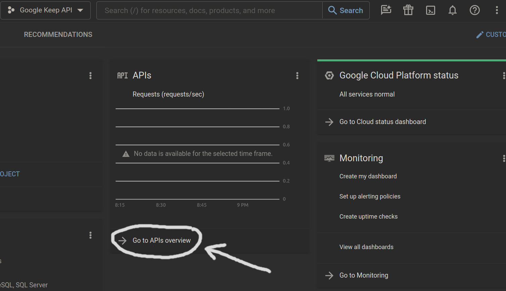

## To create Google API Key (JSON-file) you need:


### 1) Register on [Google Cloud][reg-google-cloud]

### 2) Create [new project][create-new-project] (use existing project if you want)

### 3) Go to project's [manage][project-manage] and select your new project



### 4) Go to project's settings



### 5) Choose "IAM & Admin" from navigation menu -> "Service accounts"

### 6) Create service account (you can use existing service account if you want)

### 7) Choose in list your service account and go to "Actions" -> "Manage keys"

### 8) Add key (Create new key)

<br><hr>

## Link Google Drive API key:

### After when you have Google API key you should:

### 1) Download JSON-file with API-key

### 2) Rename your JSON to "service_account_access.json"

### 3) Move it to "/full/path/to/project/data/service_account_access.json"

### 4) Open "/full/path/to/project/data/constants.py"

### 5) Set "SERVICE_ACCOUNT_FILE" to "/full/path/to/project/data/service_account_access.json"

### 6) Add "SCOPES"

> recommended:
> > "https://www.googleapis.com/auth/drive" for Google Drive
> > and "https://www.googleapis.com/auth/keep" for Google Keep

<br><hr>

## Link Google Keep API key:

### After when you have Google API key you should:

### 1) Go to "Navigation Menu" -> "Cloud overview" -> "Dashboard"

### 2) Go to "APIs & Services"



### 3) Select "Enable APIs and services" in menu

### 4) Go to the "API library" from a link on a page with a short one-line description

### 5) Enter in search line "keep" and follow the given result

### 6) Click "Enable"

<br><hr>

```python
# it's data/constants.py file

from pathlib import Path

from google.oauth2 import service_account
from googleapiclient.discovery import build


BASE_DIR = Path(__file__).parent.parent

SCOPES = ['your_scope']
SERVICE_ACCOUNT_FILE = f'{BASE_DIR}/data/service_account_access.json'

CREDENTIALS = service_account.Credentials.from_service_account_file(SERVICE_ACCOUNT_FILE, scopes=SCOPES)
SERVICE = build('drive', 'v3', credentials=CREDENTIALS)
# SERVICE = build('keep', 'v1', credentials=CREDENTIALS)
```

[reg-google-cloud]: https://cloud.google.com/artifact-registry

[create-new-project]: https://console.cloud.google.com/projectcreate?previousPage=%2Fapis%2Flibrary%3Fproject%3Dconcise-ion-399020&organizationId=0

[project-manage]: https://console.cloud.google.com/apis/library
